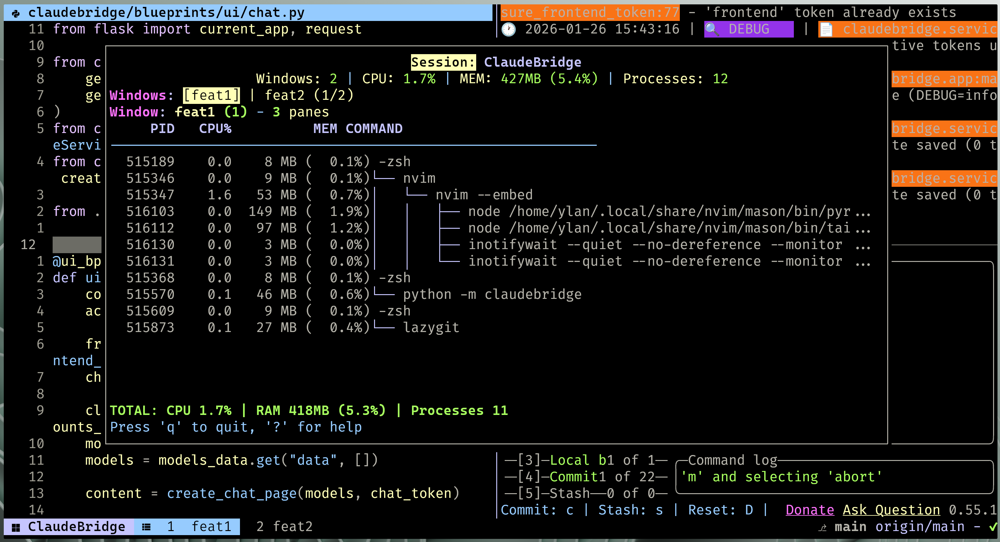
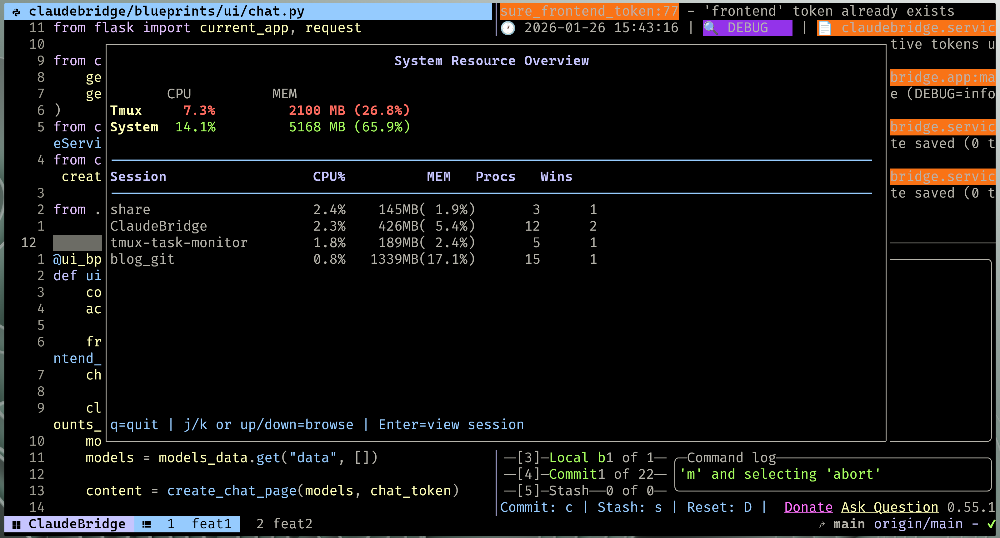

# tmux Resource Monitor Plugin

A tmux plugin for monitoring resource usage (CPU and memory) of the children processes of your tmux sessions grouped by window with an interactive curses-based interface.


## Problem

You may have access to a full list of processes on `htop`, but how often do you have to look for the right instance of the server to restart?  
How often are you trying to understand which process belongs to what within the context of your project?  
Have you ever wondered which instance of tsserver/rust-analyzer to kill to get half your RAM back?  


## Solution and features

- 📊 Real-time resource monitoring (CPU and memory)
- 🔄 Process tree visualization with parent/child relationships grouped by windows and filtered by current tmux session
- 🖱️ Interactive process browsing for yanking PID or commands 
- ⚡ Kill processes or send custom signals



**With this plugin you can**
- have a clear view of what resource/process are being used by the current tmux-session
- easily kill specific processes (press `x`)
- or send any signal with `s` followed by the SIGTERM your want to send
- yank commands or PID for interactive troubleshooting with `y` and `Y` respectively
- easily switch between windows with `h`/`l` or `←`/`→`
- or horizontal scroll long process commands with `Alt+h`/`Alt+l` or `Alt+←`/`Alt+→` 



**But you can also monitor your entire tmux session manager instance with the overview mode**:
- list all of the tmux sessions and their resource usage
- compare your your global tmux resource usage across sessions relative to the system resource usage
- jump into a specific session's detail with `j`/`k` and `enter`


## Installation

### Using TPM (Recommended)

1. Install [TPM](https://github.com/tmux-plugins/tpm) if not already installed:
   ```bash
   git clone https://github.com/tmux-plugins/tpm ~/.tmux/plugins/tpm
   ```

2. Add the plugin to your `~/.tmux.conf`:
   ```bash
   set -g @plugin 'YlanAllouche/tmux-resource-monitor'
   ```

3. Reload tmux and install plugins by pressing:
   - `prefix + I` (capital i) inside tmux
   - OR run: `~/.tmux/plugins/tpm/bin/install_plugins.sh`

## Configuration

Add these options to your `~/.tmux.conf` before or after loading the plugin:

```bash
# Refresh rate in seconds (default: 2.0)
set -g @tmux_resource_monitor_refresh_rate "2.0"

# Popup width (default: 80%)
set -g @tmux_resource_monitor_width "80%"

# Popup height (default: 80%)
set -g @tmux_resource_monitor_height "40%"
```

## Usage

Once installed, press (prefix+) `t` to open the resource monitor popup.

### Keyboard Controls

#### Navigation
- `t` - Open monitor popup
- `h`/`l` or `←`/`→` - Navigate between windows
- `j`/`k` or `↑`/`↓` - Navigate up/down through processes

#### Process Actions (when process browsing is active)
- `x` - Send SIGTERM (15) to selected process
- `s` - Enter signal number to send custom signal
- `y` - Copy process command to clipboard
- `Y` - Copy process PID to clipboard

#### Display Controls
- `Alt+h`/`Alt+l` or `Alt+←`/`Alt+→` - Scroll long command lines
- `?` - Show help screen
- `q` or `Q` - Quit monitor

## Requirements

- Python 3.6 or higher
- `psutil` Python library
- tmux 3.0 or higher
- TPM (optional, for automatic installation)

### Installing Python Dependencies

```bash
pip install psutil
```

Or using your system package manager:
```bash
sudo pacman -S python-psutil
```

## Clipboard Support

The plugin supports clipboard operations on Wayland and X11:

- **Wayland**: Uses `wl-copy`
- **X11**: Falls back to `xclip` or `xsel`

Ensure one of these tools is installed for clipboard functionality to work.

## License

MIT

## Contributing

Contributions are welcome! Please feel free to submit issues or pull requests.
